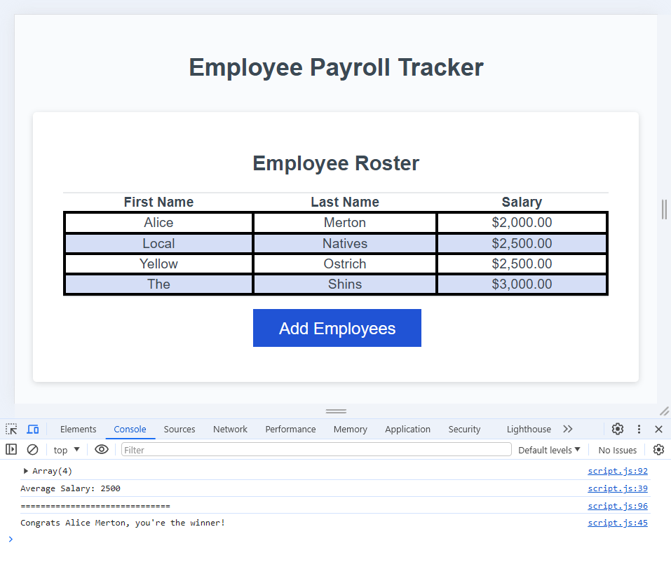

# Employee Payroll Tracker

## Description

This application enables a payroll manager to view and manage employee payroll data. After entering employee data, the information is compiled into a chart. The average salary is calculated and displayed in the console, as well as a randomly selected employee of the month.

## Usage

To add employees to the Roster, click the blue "Add Employees" button. Several prompt boxes will pop up, asking for the employee's first name, last name, and salary. Do not include a '$' or other symbols or letters in the salary. If you do, the salary will default to 0. Then a prompt box will ask, "Would you like to add another employee?" Click yes to add another or click cancel to stop. You'll be re-prompted after each employee. When you finish adding employees, the data will appear in a chart, sorted from lowest salary to greatest. The average salary will be calculated and displayed in the browser's console, along with a randomly selected employee. To open the console, use the keyboard shortcut: "Ctrl + Shift + J" on Windows or "Cmd + Option + J" on a Mac.

You can click the "Add Employees" button again to add more employees. A new average salary and randomly selected employee will generate.

The following screenshot shows the application after adding employees, and with the console open to view the average salary and random employee.

## Credits

Starter code for this project was created and supplied by staff at my edX coding boot camp, and can be found in the first commit of the repository.